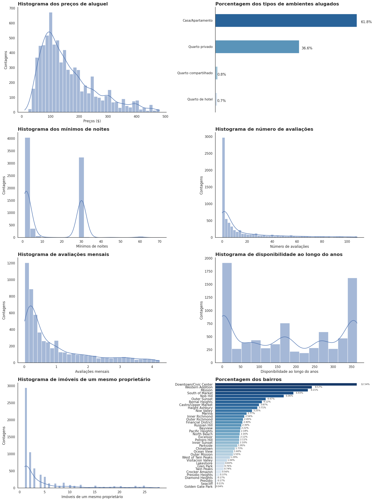
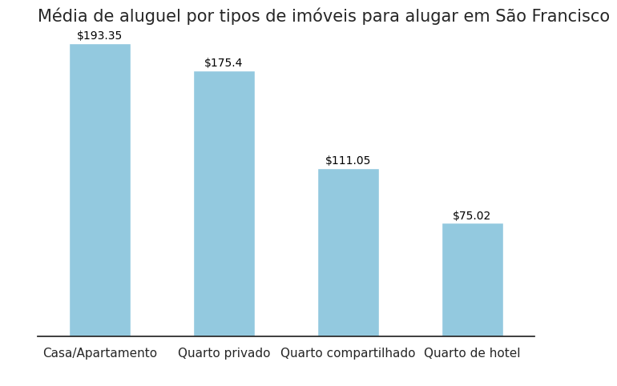
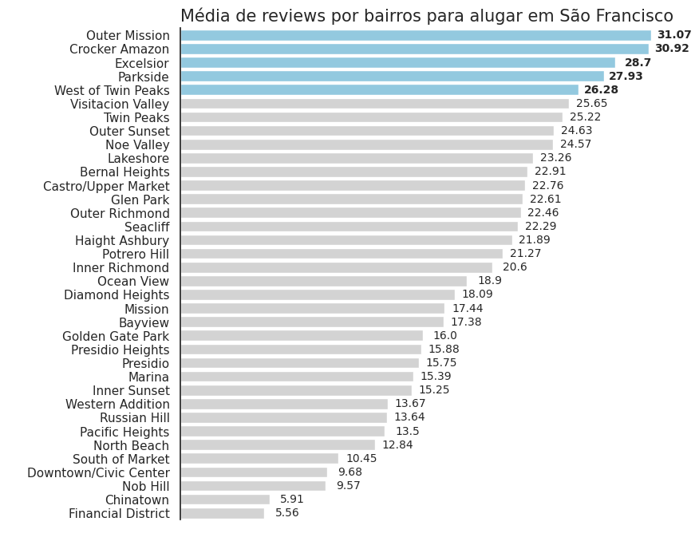

# Análise dos dados do Airbnb

Com o objetivo de estudar a extração de informação a partir de dados de empresas, este projeto mostra uma análise dos dados do Aribnb para a região São Francisco, California.

  

  Fonte: (https://vidacigana.com/como-funciona-o-airbnb/)

## São Francisco

  

Prefiro que antes de realizar uma análise exploratória de dados específicos, considero realizar uma pesquisa abrangente sobre os tópicos relacionados aos dados em questão. Essa busca por informações não apenas pode proporcionar insights valiosos, mas também auxiliar na identificação de padrões e significados subjacentes aos resultados obtidos durante a análise.

No caso presente, me concentrei na análise nos dados do Airbnb referentes à cidade de São Francisco. Inicialmente, é evidente que o foco será a localização e valores das residências disponíveis para aluguel, assim como informações pertinentes à proposta em questão.

São Francisco, localizada no norte da Califórnia, na região do litoral oeste dos Estados Unidos, possui uma população de aproximadamente 900 mil habitantes. Fundada em 1776 pelos padres franciscanos, daí originando-se o nome da cidade, São Francisco tornou-se amplamente reconhecida a partir de 1848, ano em que ocorreu uma importante descoberta na região.

Considerada um destino popular para viajantes internacionais, a cidade atraiu cerca de 10,2 milhões de turistas em 2022, marcando uma significativa redução em comparação aos anos anteriores. Em 2019, por exemplo, São Francisco registrou a impressionante marca de aproximadamente 26 milhões de visitantes. Essa diminuição no número de turistas pode ser atribuída às restrições de viagens implementadas devido à pandemia do Coronavírus, destacando o impacto significativo da crise global na indústria do turismo.

Passear por São Francisco é entrar em uma jornada pela diversidade, refletida em seus icônicos bairros, cada um contando uma história Em Castro, conhecida como a capital mundial LGBTQIA+, cafés ao ar livre e bares históricos entrelaçam-se com a vibrante narrativa do movimento de direitos. À medida que se percorre a Castro St., a história ganha vida, desde o emblemático Castro Theatre até o Twin Peaks Tavern, o primeiro bar do bairro, aberto em 1972.

  

  Fonte: (https://guia.melhoresdestinos.com.br/the-castro-92-1528-l.html)

No Presidio, antiga base militar transformada em parque, a arte de Andy Goldsworthy se mescla à majestosa vista da Golden Gate Bridge. Enquanto isso, o Walt Disney Family Museum oferece uma imersão emocionante na história da Disney. Em Chinatown, a primeira e maior da América do Norte, telhados coloridos, postes de luz de dragão e o nascimento do famoso biscoito da sorte criam uma experiência única a poucas quadras da Union Square.

  

  Fonte: (https://www.expedia.com.br/fotos/san-mateo-county/san-francisco/presidio-of-san-francisco.d502558)

O Civic Center, entre a Avenida Van Ness e a Market St., revela-se como um polo cultural, abrigando a imponente Prefeitura, o War Memorial Opera House e o renomado Asian Art Museum. Enquanto isso, Fisherman's Wharf, destino turístico por excelência, convida os visitantes a degustar deliciosos frutos do mar e explorar a histórica Alcatraz.

Haight-Ashbury, imortalizando o espírito do movimento hippie, é um marco histórico com suas lojas vintage na Upper Haight Street e as famosas Painted Ladies próximas à Alamo Square. Na Marina, vistas de tirar o fôlego, bares em ascensão e o imponente Palace of Fine Arts deslumbram os visitantes.

O Mission District, mais antigo da cidade, cativa com sua rica herança latina, murais envolventes e o histórico Dolores Park. Em Embarcadero, o movimentado bairro ao final da Market St., oferece vistas panorâmicas dos arranha-céus e da Bay Bridge, além de ser lar do Ferry Building e do interativo Exploratorium.

  

  Fonte: (https://americafromtheroad.com/mission-district-things-to-do-and-must-eats/)

## Análise
### 1. Informação dos dados e limpeza dos dados

Os dados foram adquiridos através do portal [Inside Airbnb](http://insideairbnb.com/get-the-data/), que disponibiliza diversos conjuntos de dados provenientes de várias cidades, diretamente fornecidos pela empresa Airbnb.

O Inside Airbnb é uma plataforma dedicada a fornecer informações detalhadas sobre as listagens de hospedagem, permitindo uma análise aprofundada dos padrões e tendências do mercado de aluguel. Os datasets disponibilizados abrangem uma variedade de informações relevantes, incluindo a localização das residências, características das propriedades, preços, disponibilidade, entre outros.

O conjunto de dados do Airbnb para a cidade de São Francisco consiste em **8056 entradas** (linhas) e **18 variáveis** (colunas).

Predominantemente, o conjunto de dados é composto por variáveis do tipo inteiro (int64) e objetos (object). Algumas colunas, como `neighbourhood_group`, `reviews_per_month`, `last_review`, e `license`, contêm tipos de dados float64.

Algumas colunas possuem um número considerável de valores únicos, como `id` (8056), `longitude` (5898), `latitude` (5820). No caso da variável `ìd` indica que cada dado é único, sobre a alta de valroes únicos em longitude e latitude é por elas serem váraives da localização. O dataset apresenta dados ausentes em várias colunas.

A coluna `neighbourhood_group` está completamente ausente, e a `license` possui uma taxa de ausência de 36.80%. Outras colunas, como `reviews_per_month` e `last_review`, também têm uma proporção considerável de valores ausentes, atingindo 23.39%.

**Dicionário das variáveis**

* id: identificação única para o anúncio
* name: nome do anúncio
* host_id: identificador único para o proprietário do imóvel
* host_name: nome do proprietário
* neighbourhood_group: município ao qual o imóvel pertence, geolocalizado pelas coordenadas de latitude e longitude
* neighbourhood: bairro da propriedade
* latitude: coordenada geográfica de latitude da propriedade
* longitude: coordenada geográfica de longitude da propriedade
* room_type: tipo de quarto oferecido para locação
* price: preço da diária do aluguel
* minimum_nights: quantidade mínima de noites para alugar o imóvel
* number_of_reviews: quantidade de avaliações que o imóvel tem
* last_review: data da última avaliação
* reviews_per_month: quantidade de avaliações por mês
* calculated_host_listings_count : quantidade de imóveis do mesmo proprietário na mesma cidade/região
* availability_365: número de dias disponíveis para locação nos próximos 365 dias
* number_of_reviews_ltm: quantidade de avaliações nos últimos 12 meses
* license: número de registro do imóvel

### 1.1 Descrição estatística das variáveis 
A variável `price`, que representa o valor em dólares por noite do aluguel, exibe uma média de cerca de \$228,00, com 75% dos valores abaixo de \$232,00. No entanto, chama atenção o preço máximo de \$25.000,00 e o considerável desvio padrão de \$671,91. Essa distribuição sugere a presença de valores atípicos (outliers) que podem impactar a interpretação dos resultados.

Além disso, a variável `minimum_nights` revela que a média de noites mínimas para aluguel é de aproximadamente 24 noites, com 75% dos valores abaixo de 30 noites. Entretanto, o valor máximo registrado é de 1.125 noites, um patamar fora do comum para o padrão de aluguel típico do Airbnb. Este valor elevado é notável e pode ser considerado um possível outlier, demandando uma análise mais aprofundada para compreender sua origem e impacto nas conclusões do estudo.

No que diz respeito às avaliações, a quantidade média de avaliações por mês (`reviews_per_month`) é de aproximadamente 2,06, com o valor máximo de 162, considerado alto em relação à média, e o valor de 75% de 2,13, sugerindo a presença de outliers. O mesmo se aplica à variável `number_of_reviews`, com média de 44 e 75% dos dados abaixo de 45. No entanto, ela apresenta um valor máximo de 877 e desvio padrão de 85,49, indicando a possível existência de outliers que merecem investigação mais detalhada.

A variável `calculated_host_listings_count` revela uma média de 14 propriedades por usuário, mas com um desvio de aproximadamente 32 e um valor máximo de 154. Quanto à `number_of_reviews_ltm`, há um máximo de 435, com média de 6,89 e desvio padrão de 16,51. Esses dados também apontam para a presença de valores discrepantes que podem influenciar as análises, destacando a importância de considerar esses casos ao interpretar os resultados do estudo.

### 1.2 Limpeza das variáveis

Após a limpeza dos outliers, é visto que as características das variáveis foram significativamente ajustadas. A média do preço (`price`) reduziu para \$161.22, com um desvio padrão de \$94.97.

A quantidade mínima de noites (`minimum_nights`) apresentou uma média de 14.25, com um desvio padrão de 14.40. A redução na dispersão dos dados sugere que a maioria das propriedades requer um número mais razoável de noites mínimas para locação, eliminando valores extremos que distorciam a média anteriormente.

A variável `number_of_reviews` agora possui uma média de 16.35, com um desvio padrão de 25.01.

A média de avaliações por mês (`reviews_per_month`) foi ajustada para 0.95, com um desvio padrão de 1.07. Esse resultado mais homogêneo sugere uma distribuição mais estável da frequência de avaliações mensais.

A média de propriedades listadas por usuário (`calculated_host_listings_count`) foi ajustada para 4.29, com um desvio padrão de 5.72. Esse ajuste indica uma distribuição mais concentrada em comparação com os dados anteriores.

Por fim, a quantidade média de avaliações nos últimos 12 meses (`number_of_reviews_ltm`) foi ajustada para 2.74, com um desvio padrão de 4.50.

A limpeza então permitiu uma distribuição mais centrada e menos influenciada por valores extremos.

### 2. Análise univariada

Numa abordagem inicial de análise de dados, acho interessante formular  algumas perguntas específicas para orientar a investigação e direcionar a visualização das informações por meio de gráficos relevantes.

A fase de análise univariada concentra-se na avaliação de uma única variável, considerando sua distribuição e proporção nos dados. Ao compreender como uma variável se distribui, pode ser visto tendências, anomalias e características distintivas. Essa abordagem proporciona uma visão detalhada dos dados, possibilitando a escolha adequada de gráficos que melhor representem as características da variável em questão.

Algumas perguntas sugeridas:

* Qual é a distribuição dos preços das diárias de aluguel?

* Quais são os tipos mais comuns de quartos oferecidos para locação? Existe uma predominância em algum tipo?

* Como a quantidade mínima de noites para alugar varia entre as propriedades?

* Como as avaliações estão distribuídas?

* Como está distribuída a quantidade de avaliações por mês?

* Como a disponibilidade ao longo do ano se distribui?

* Qual é a distribuição da quantidade de imóveis que um mesmo proprietário possui na cidade?

* Como as propriedades estão distribuídas geograficamente na cidade? Existe alguma concentração em bairros específicos?

  

  Fonte: Autor

Análise dos gráficos revela as seguintes conclusões:

Os valores de aluguel concentram-se predominantemente entre $10,00 e $200,00, com uma expressiva quantidade de imóveis alugados em torno de $100,00.

Casas/Apartamentos são os tipos de propriedades mais alugados, representando 61,8% das locações, enquanto quartos de hotéis são menos procurados, com apenas 0,7%.

Os períodos de aluguel mais populares abrangem estadias de 0 a 5 noites, assim como estadias de 30 noites. Isso reflete uma diversidade nas necessidades dos locatários, abrangendo tanto estadias temporárias quanto prolongadas.

A maioria das avaliações situa-se na faixa de 0 a 5, indicando uma concentração de feedbacks positivos.

A disponibilidade de imóveis é significativa, variando de 0 a 25 dias e atingindo um pico em torno de 350 dias.

A maioria dos proprietários de imóveis possui apenas uma propriedade, sugerindo uma participação considerável de proprietários individuais no Airbnb.

Em termos de distribuição por bairros, 12,54% dos imóveis estão localizados em Downtown/Civic Center, seguido por Western Addition com 8,57%. Por outro lado, a presença de imóveis em Golden Gate Park é mínima, representando apenas 0,04%.

### 3. Análise multivariada

Perguntas possíveis a serem realizadas:

- Qual a relação entre o preço e o tipo de quarto?
- A localização (bairro) influencia no número de avaliações ou no preço das diárias?
- A quantidade de imóveis em cada bairro?
- Como as avaliações afetam o preço das diárias?
- Propriedades com mais avaliações por mês tendem a ter preços mais altos?
- Existe uma relação entre a quantidade mínima de noites e a disponibilidade ao longo do ano?

  

  Fonte: Autor

Em primeiro lugar dos tipos de imóveis mais caros está casas/apartamentos com valor médio de aluguel de \$193.3. Quartos privativos custam em média \$175.4, sendo o segundo imóvel mais caro. O mais barato dos imóveis são quartos de hotéis com valor médio de alguel de \$75.02.

  

  Fonte: Autor

Os cinco bairros mais caros de aluguel são Finacial District (\$221.08), North Beach (\$212.38), Castro/Upper Market (\$208.36), Presidio (\$207.75), Chinatown (\$203.32).

  

  Fonte: Autor

Se compararmos o gráfico acima sobre as reviews por bairro, temos uma situação interessante, que 2 dos bairros dos 5 mais caros, Financial Dsistrict, são os que apresentam menores médias de avaliaçãoes com 5,91 e 5,56 respectivamente.
Os 5 bairros mais bem avaliados são Outer Mission, Crocker Amazon, Excelsior e Parkside.

  

  Fonte: Autor

Conclusões sobre as correlações:

- A relação entre preço e outras variáveis é, em geral, fraca.
- O número mínimo de noites tem uma relação negativa com a disponibilidade e uma relação moderada e negativa com o número de reviews a longo prazo.
- O número de reviews está fortemente relacionado tanto com o número de reviews a longo prazo quanto com a quantidade de reviews por mês.
- A disponibilidade ao longo do ano tem uma relação fraca com várias variáveis, incluindo preço e número de reviews a longo prazo.

### 4. Conclusões

Este projeto teve o objetivo de realizar uma análise dos dados do Airbnb da cidade de São Francisco. De inicio foi nessário uma limpeza em agumas variáveis, como a avariável neighbourhood_group não possuia entradas.
Foi necessário realizar uma limpeza de outliers nas variáveis `price` e `minimum_nights`. É interessante realizar essa limpeza pois são variáveis que podem ser consideradas importantes para uma escolha de determinado lugar.

Após isso foi para facilitar o processo de análise realizei algumas perguntas para realizar uma análise univariada e multivariada.

Ao analisar os gráficos, observamos que a maioria dos aluguéis concentra-se em valores próximos a $100, com uma representação expressiva de casas/apartamentos (61,8%) e uma preferência por períodos de 0 a 5 noites. O número de avaliações predominam na faixa de 0 a 5s. A maioria dos proprietários possui apenas um imóvel, sugerindo participação significativa de indivíduos no Airbnb.

Na categorização dos imóveis por preço médio de aluguel, casas/apartamentos lideram com \$193.3, seguidos por quartos privativos (\$175.4) e quartos de hotéis (\$75.02). Os bairros mais caros incluem Financial District, North Beach, Castro/Upper Market, Presidio e Chinatown, enquanto Outer Mission, Crocker Amazon, Excelsior e Parkside são os mais bem avaliados.

As análises de correlação revelam que a relação entre preço e outras variáveis é geralmente fraca. O número mínimo de noites mostra uma relação negativa com disponibilidade e uma moderada relação negativa com o número de reviews a longo prazo. O número de reviews está fortemente relacionado tanto com os reviews a longo prazo quanto com a quantidade de reviews por mês. A disponibilidade ao longo do ano apresenta relações fracas com várias variáveis, incluindo preço e número de reviews a longo prazo.

## Referências inspiradas 

“12 bairros para conhecer em São Francisco,” Qual Viagem. Accessed: Feb. 01, 2024. [Online]. Available: https://www.qualviagem.com.br/12-bairros-para-conhecer-em-sao-francisco/

Análise de Dados em Python, (Nov. 12, 2022). Accessed: Feb. 01, 2024. [Online Video]. Available: https://www.youtube.com/watch?v=9n9bFWWBkLg

Curso rápido completo de Pandas - Parte 1, (Sep. 23, 2020). Accessed: Feb. 01, 2024. [Online Video]. Available: https://www.youtube.com/watch?v=6vpDSD1wchA

T. Corrêa, “Metodologia de análise de dados: um guia completo sobre o tema,” Blog da Ploomes. Accessed: Feb. 01, 2024. [Online]. Available: https://blog.ploomes.com/analise-de-dados/

T. AI, “Seaborn Tutorial 💹,” The Startup. Accessed: Feb. 01, 2024. [Online]. Available: https://medium.com/swlh/seaborn-tutorial-2e749e084ad6

