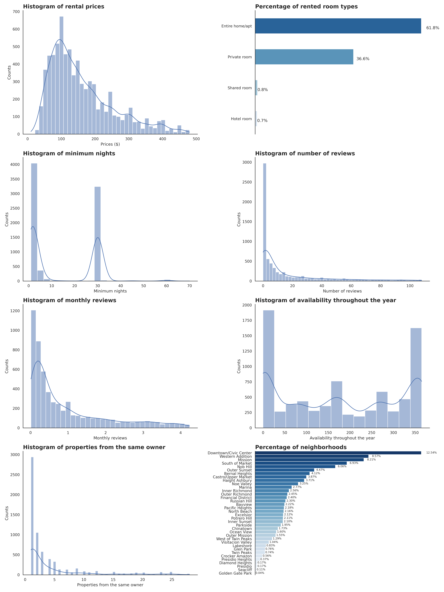
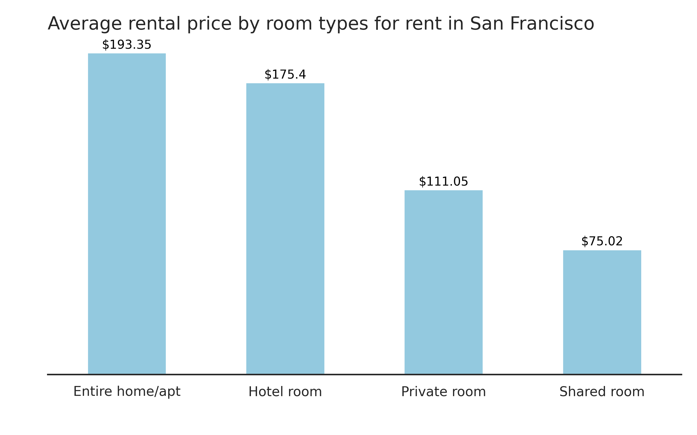
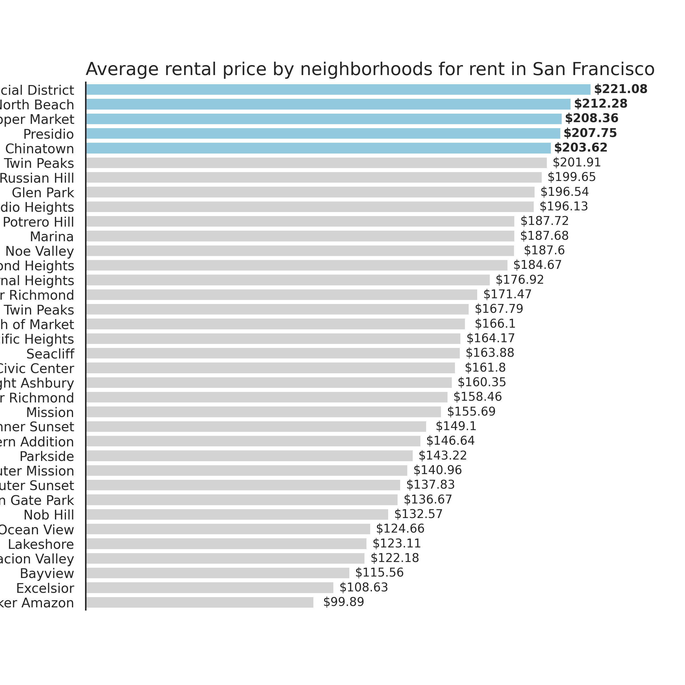
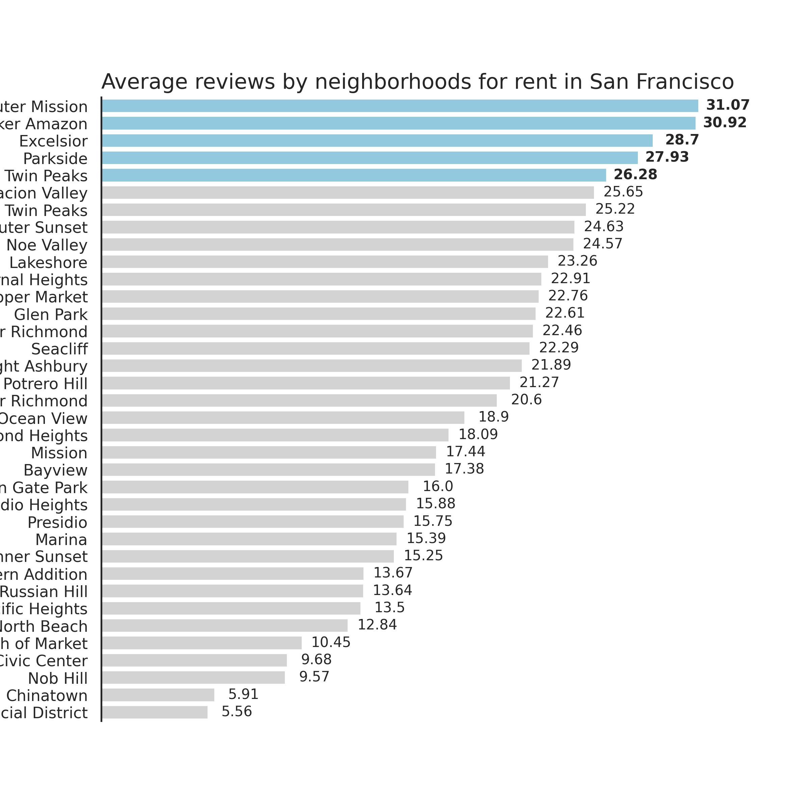
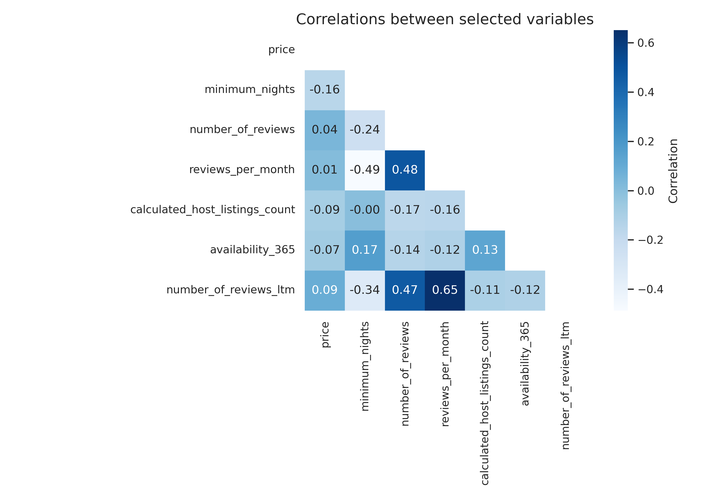

# Airbnb Data Analysis

With the goal of studying information extraction from company data, this project presents an analysis of Airbnb data for the San Francisco, California region

## San Francisco

  

  Font: (https://blog.123milhas.com/o-que-fazer-em-san-francisco-pontos-turisticos-e-passeios/)

Before conducting a specific exploratory data analysis, it's important to conduct a comprehensive research on topics related to the data at hand. This search for information can not only provide valuable insights but also assist in identifying patterns and underlying meanings behind the analysis results.

In the present case, I focused on analyzing Airbnb data for the city of San Francisco. Initially, it's evident that the focus will be on the location and values of residential properties available for rent, as well as relevant information to the proposed analysis.

San Francisco, located in northern California on the west coast of the United States, has a population of approximately 900,000 inhabitants. Founded in 1776 by Franciscan friars, hence the city's name, San Francisco became widely recognized starting from 1848, the year of an important discovery in the region.

Considered a popular destination for international travelers, the city attracted around 10.2 million tourists in 2022, marking a significant reduction compared to previous years. In 2019, for example, San Francisco recorded an impressive number of approximately 26 million visitors. This decrease in the number of tourists can be attributed to travel restrictions implemented due to the Coronavirus pandemic, highlighting the significant impact of the global crisis on the tourism industry.

Exploring San Francisco is embarking on a journey through diversity, reflected in its iconic neighborhoods, each telling a story. In Castro, known as the LGBTQIA+ world capital, outdoor cafes and historic bars intertwine with the vibrant narrative of the rights movement. As one walks down Castro St., history comes to life, from the iconic Castro Theatre to the Twin Peaks Tavern, the neighborhood's first bar, opened in 1972.

  

  Font: (https://guia.melhoresdestinos.com.br/the-castro-92-1528-l.html)

In Presidio, a former military base transformed into a park, Andy Goldsworthy's art blends with the majestic view of the Golden Gate Bridge. Meanwhile, the Walt Disney Family Museum offers an exciting immersion into the history of Disney. In Chinatown, the first and largest in North America, colorful rooftops, dragon light poles, and the birth of the famous fortune cookie create a unique experience just a few blocks from Union Square.

  

  Fonte: (https://www.expedia.com.br/fotos/san-mateo-county/san-francisco/presidio-of-san-francisco.d502558)

The Civic Center, between Van Ness Avenue and Market St., reveals itself as a cultural hub, housing the imposing City Hall, the War Memorial Opera House, and the renowned Asian Art Museum. Meanwhile, Fisherman's Wharf, a quintessential tourist destination, invites visitors to taste delicious seafood and explore the historic Alcatraz.

Haight-Ashbury, immortalizing the spirit of the hippie movement, is a historical landmark with its vintage shops on Upper Haight Street and the famous Painted Ladies near Alamo Square. In the Marina, breathtaking views, rising bars, and the imposing Palace of Fine Arts dazzle visitors.

The Mission District, the city's oldest, captivates with its rich Latino heritage, engaging murals, and the historic Dolores Park. In Embarcadero, the bustling neighborhood at the end of Market St., offers panoramic views of skyscrapers and the Bay Bridge, as well as being home to the Ferry Building and the interactive Exploratorium.

  

  Fonte: (https://americafromtheroad.com/mission-district-things-to-do-and-must-eats/)

## Analyse
### 1. Informations about the data and data cleaning

[Inside Airbnb](http://insideairbnb.com/get-the-data/) is a platform dedicated to providing detailed information about lodging listings, allowing for in-depth analysis of rental market patterns and trends. The datasets available cover a variety of relevant information, including residence locations, property features, prices, availability, among others.

The Airbnb dataset for the city of San Francisco consists of **8056 entries** (rows) and **18 variables** (columns).

Predominantly, the dataset is composed of integer (int64) and object (object) data types. Some columns, such as `neighbourhood_group`, `reviews_per_month`, `last_review`, and `license`, contain float64 data types.

Some columns have a considerable number of unique values, such as `id` (8056), `longitude` (5898), `latitude` (5820). Regarding the `id` variable, it indicates that each data point is unique, while the high number of unique values in longitude and latitude is due to them being location variables. The dataset contains missing data in several columns.

The `neighbourhood_group` column is completely absent, and the `license` column has a missing rate of 36.80%. Other columns, such as `reviews_per_month` and `last_review`, also have a considerable proportion of missing values, reaching 23.39%.

**Dictionary of variables**

| Variable                      | Description                                                                                 |
|-------------------------------|---------------------------------------------------------------------------------------------|
| id                            | Unique identifier for the listing                                                           |
| name                          | Listing name                                                                                |
| host_id                       | Unique identifier for the property owner                                                     |
| host_name                     | Property owner's name                                                                       |
| neighbourhood_group           | Municipality to which the property belongs, geolocated by latitude and longitude coordinates |
| neighbourhood                 | Property's neighborhood                                                                     |
| latitude                      | Geographic latitude coordinate of the property                                                |
| longitude                     | Geographic longitude coordinate of the property                                               |
| room_type                     | Type of room offered for rental                                                             |
| price                         | Rental price per night                                                                      |
| minimum_nights                | Minimum number of nights to rent the property                                                 |
| number_of_reviews             | Number of reviews the property has                                                            |
| last_review                   | Date of the last review                                                                      |
| reviews_per_month             | Number of reviews per month                                                                  |
| calculated_host_listings_count| Number of properties by the same owner in the same city/region                                |
| availability_365              | Number of days available for rent in the next 365 days                                        |
| number_of_reviews_ltm         | Number of reviews in the last 12 months                                                       |
| license                       | Property registration number                                                                 |

### 1.1 Statistical description of variables
The variable `price`, which represents the price in dollars per night of the rental, shows an average of about \$228.00, with 75% of the values below \$232.00. However, the maximum price of \$25,000.00 and the considerable standard deviation of \$671.91 draw attention. This distribution suggests the presence of outliers that can impact the interpretation of the results.

Furthermore, the variable `minimum_nights` reveals that the average minimum nights for rental is approximately 24 nights, with 75% of the values below 30 nights. However, the maximum value recorded is 1,125 nights, a level outside the typical Airbnb rental pattern. This high value is notable and may be considered a possible outlier, requiring further analysis to understand its origin and impact on the study's conclusions.

Regarding the reviews, the average number of reviews per month (`reviews_per_month`) is approximately 2.06, with the maximum value of 162, considered high compared to the average, and the 75th percentile of 2.13, suggesting the presence of outliers. The same applies to the variable `number_of_reviews`, with an average of 44 and 75% of the data below 45. However, it has a maximum value of 877 and a standard deviation of 85.49, indicating the possible existence of outliers that deserve further investigation.

The variable `calculated_host_listings_count` reveals an average of 14 properties per user, but with a deviation of approximately 32 and a maximum value of 154. As for `number_of_reviews_ltm`, there is a maximum of 435, with an average of 6.89 and a standard deviation of 16.51. These data also point to the presence of discrepant values that can influence the analyses, highlighting the importance of considering these cases when interpreting the study's results.

### 1.2 Variable Cleaning

After cleaning the outliers, it is observed that the characteristics of the variables have been significantly adjusted. The mean price (`price`) reduced to \$161.22, with a standard deviation of \$94.97.

The minimum number of nights (`minimum_nights`) showed an average of 14.25, with a standard deviation of 14.40. The reduction in data dispersion suggests that most properties require a more reasonable number of minimum nights for rental, eliminating extreme values that previously distorted the mean.

The variable `number_of_reviews` now has a mean of 16.35, with a standard deviation of 25.01.

The mean reviews per month (`reviews_per_month`) was adjusted to 0.95, with a standard deviation of 1.07. This more homogeneous result suggests a more stable distribution of monthly review frequency.

The mean of properties listed per user (`calculated_host_listings_count`) was adjusted to 4.29, with a standard deviation of 5.72. This adjustment indicates a more concentrated distribution compared to the previous data.

Finally, the average number of reviews in the last 12 months (`number_of_reviews_ltm`) was adjusted to 2.74, with a standard deviation of 4.50.

The cleaning process thus allowed for a more centered distribution and less influenced by extreme values.

### 2. Univariate Analysis

In an initial approach to data analysis, it is interesting to formulate some specific questions to guide the investigation and direct the visualization of information through relevant graphs.

The univariate analysis phase focuses on evaluating a single variable, considering its distribution and proportion in the data. By understanding how a variable is distributed, trends, anomalies, and distinctive characteristics can be observed. This approach provides a detailed view of the data, enabling the appropriate selection of graphs that best represent the characteristics of the variable in question.

Some suggested questions include:

- What is the distribution of rental prices per night?
- What are the most common types of rooms offered for rent? Is there a predominance of any type?
- How does the minimum number of nights for rent vary among properties?
- How are reviews distributed?
- How is the distribution of reviews per month?
- How is availability throughout the year distributed?
- What is the distribution of the number of properties owned by the same owner in the city?
- How are properties geographically distributed in the city? Is there any concentration in specific neighborhoods?

  

  Font: Author

The analysis of the graphs reveals the following conclusions:

- Rental prices are predominantly concentrated between $10.00 and $200.00, with a significant number of properties rented around $100.00.
  
- Houses/Apartments are the most rented property types, accounting for 61.8% of the rentals, while hotel rooms are less sought after, with only 0.7%.

- The most popular rental periods range from 0 to 5 nights, as well as 30-night stays. This reflects a diversity in renters' needs, covering both temporary and extended stays.

- The majority of reviews fall within the range of 0 to 5, indicating a concentration of positive feedback.

- Property availability is significant, ranging from 0 to 25 days and peaking around 350 days.

- Most property owners own only one property, suggesting a significant participation of individual owners in Airbnb.

- In terms of distribution by neighborhoods, 12.54% of properties are located in Downtown/Civic Center, followed by Western Addition with 8.57%. On the other hand, the presence of properties in Golden Gate Park is minimal, representing only 0.04%.

### 3. Multivariate Analysis
Possible questions to be addressed:

What is the relationship between price and room type?
Does the location (neighborhood) influence the number of reviews or the price of rentals?
How does the quantity of properties vary across neighborhoods?
How do reviews affect rental prices?
Do properties with more reviews per month tend to have higher prices?
Is there a relationship between the minimum number of nights and availability throughout the year?

  

  Font: Author

Firstly, among the types of properties, houses/apartments are the most expensive, with an average rental price of $193.3. Private rooms follow as the second most expensive, with an average price of $175.4. The cheapest option among the properties are hotel rooms, with an average rental price of $75.02.

  

  Font: Author

The five most expensive neighborhoods for rent are Financial District ($221.08), North Beach ($212.38), Castro/Upper Market ($208.36), Presidio ($207.75), and Chinatown ($203.32).

  

  Font: Author

If we compare the graph above about the reviews by neighborhood, we have an interesting situation where 2 of the neighborhoods among the top 5 most expensive, Financial District, have the lowest average reviews with 5.91 and 5.56 respectively. The top 5 neighborhoods with the highest ratings are Outer Mission, Crocker Amazon, Excelsior, and Parkside.

  

  Font: Author

Conclusions about the correlations:

- The relationship between price and other variables is generally weak.
- The minimum number of nights has a negative relationship with availability and a moderate, negative relationship with the number of long-term reviews.
- The number of reviews is strongly related to both the number of long-term reviews and the quantity of reviews per month.
- Availability throughout the year has a weak relationship with several variables, including price and the number of long-term reviews.

### 4. Conclusions

This project aimed to conduct an analysis of Airbnb data for the city of San Francisco. Initially, it was necessary to clean some variables, as the `neighbourhood_group` variable had no entries. Outlier cleaning was also required for the `price` and `minimum_nights` variables. This cleaning process is important as these variables are considered crucial factors in the decision-making process for choosing a particular location.

Afterward, to facilitate the analysis process, I formulated some questions to conduct both univariate and multivariate analyses.

Upon analyzing the graphs, we observed that the majority of rentals are concentrated around $100, with a significant representation of houses/apartments (61.8%) and a preference for rental periods of 0 to 5 nights. The number of reviews predominates in the 0 to 5 range. Most property owners have only one property, suggesting significant individual participation in Airbnb.

Regarding the categorization of properties by average rental price, houses/apartments lead with \$193.3, followed by private rooms (\$175.4) and hotel rooms (\$75.02). The most expensive neighborhoods include the Financial District, North Beach, Castro/Upper Market, Presidio, and Chinatown, while Outer Mission, Crocker Amazon, Excelsior, and Parkside are the highest-rated ones.

Correlation analyses revealed that the relationship between price and other variables is generally weak. The minimum number of nights shows a negative relationship with availability and a moderate negative relationship with the number of long-term reviews. The number of reviews is strongly correlated with both long-term reviews and the quantity of reviews per month. Availability throughout the year has weak relationships with several variables, including price and the number of long-term reviews.

## References Inspired

“12 bairros para conhecer em São Francisco,” Qual Viagem. Accessed: Feb. 01, 2024. [Online]. Available: https://www.qualviagem.com.br/12-bairros-para-conhecer-em-sao-francisco/

Análise de Dados em Python, (Nov. 12, 2022). Accessed: Feb. 01, 2024. [Online Video]. Available: https://www.youtube.com/watch?v=9n9bFWWBkLg

Curso rápido completo de Pandas - Parte 1, (Sep. 23, 2020). Accessed: Feb. 01, 2024. [Online Video]. Available: https://www.youtube.com/watch?v=6vpDSD1wchA

T. Corrêa, “Metodologia de análise de dados: um guia completo sobre o tema,” Blog da Ploomes. Accessed: Feb. 01, 2024. [Online]. Available: https://blog.ploomes.com/analise-de-dados/

T. AI, “Seaborn Tutorial 💹,” The Startup. Accessed: Feb. 01, 2024. [Online]. Available: https://medium.com/swlh/seaborn-tutorial-2e749e084ad6

